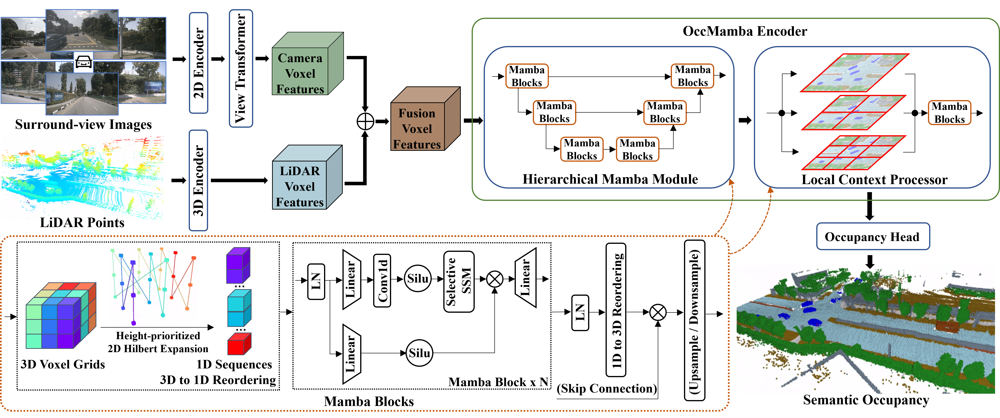

<div align="center">   

# OccMamba: Semantic Occupancy Prediction with State Space Models
</div>

# Abstract 

Training deep learning models for semantic occupancy prediction is challenging due to factors such as a large number of occupancy cells, severe occlusion, limited visual cues, complicated driving scenarios, etc. Recent methods often adopt transformer-based architectures given their strong capability in learning input-conditioned weights and long-range relationships. However, transformer-based networks are notorious for their quadratic computation complexity, seriously undermining their efficacy and deployment in semantic occupancy prediction. Inspired by the global modeling and linear computation complexity of the Mamba architecture, we present the first Mamba-based network for semantic occupancy prediction, termed OccMamba. Specifically, we first design the hierarchical Mamba module and local context processor to better aggregate global and local contextual information, respectively. Besides, to relieve the inherent domain gap between the linguistic and 3D domains, we present a simple yet effective 3D-to-1D reordering scheme, i.e., height-prioritized 2D Hilbert expansion. It can maximally retain the spatial structure of 3D voxels as well as facilitate the processing of Mamba blocks. Endowed with the aforementioned designs, our OccMamba is capable of directly and efficiently processing large volumes of dense scene grids, achieving state-of-the-art performance across three prevalent occupancy prediction benchmarks, including OpenOccupancy, SemanticKITTI, and SemanticPOSS. Notably, on OpenOccupancy, our OccMamba outperforms the previous state-of-the-art Co-Occ by **5.1%** IoU and **4.3%** mIoU, respectively.

[arXiv](https://arxiv.org/abs/2408.09859) 

# News
- **[2025/03/10]** Our code has been updated to the new version.
- **[2025/02/27]** OccMamba is accepted to CVPR 2025!
- **[2024/09/25]** We have released our code.

# Pipeline


# Getting Started
**1. Create a conda virtual environment and activate it.**
```shell
conda create -n OccMamba python=3.9 -y
conda activate OccMamba
```

**2. Install PyTorch (tested on torch==1.13.1 & cuda=11.7/11.8).**
```shell
pip install torch==1.13.1+cu117 torchvision==0.14.1+cu117 torchaudio==0.13.1 --extra-index-url https://download.pytorch.org/whl/cu117
```

**3. Install gcc>=5 in conda env.**
```shell
conda install -c omgarcia gcc-6 # gcc-6.2
```

**4. Install mmcv, mmdet, mmseg and mmdet3d. These versions is not mandatory, but code changes may be required**
```shell
pip install mmcv-full==1.7.0 -f https://download.openmmlab.com/mmcv/dist/cu117/torch1.13/index.html
pip install mmdet==2.26.0 mmsegmentation==0.30.0 mmdet3d==1.0.0rc5
```

**5. Install other dependencies.**
```shell
pip install timm open3d-python PyMCubes spconv-cu117 fvcore IPython
pip install causal-conv1d==1.2.0.post2 mamba-ssm==1.2.0.post1 # other versions are not tested
pip install numpy==1.22.4 yapf==0.40.1 # downgrade
```

**6. Install occupancy pooling, same to the OpenOccupancy.**
```shell
export PYTHONPATH=“.”
python setup.py develop
```

**7. Fix some dependence crash.**
```shell
cp dependence/dag.py path_to_conda_env/OccMamba/lib/python3.9/site-packages/networkx/algorithms/dag.py
```

**8. Prepare the dataset by following the [instructions](https://github.com/JeffWang987/OpenOccupancy/blob/main/docs/prepare_data.md) in OpenOccupancy.**

# Training and Inference
**1. Training examples.**
```shell
bash run.sh $PATH_TO_CFG $GPU_NUM
bash run.sh ./projects/configs/OccMamba/Multimodal-OccMamba-384.py 8
```

**2. Inference examples. If you want to save prediction results, use `--show` and `--show-dir`.**
```shell
bash run_eval.sh $PATH_TO_CFG $PATH_TO_CKPT $GPU_NUM
bash run_eval.sh $PATH_TO_CFG $PATH_TO_CKPT $GPU_NUM --show --show-dir $PATH_TO_SAVE
```

# Visualization
**Visualization example.**
```
python tools/visual.py $PATH_TO_NPY
```

# Trained Weights
**We provide download links and performance for Multimodal OccMamba weights in the table below. Please note that if you encounter a mismatch issue when loading spconv weights due to different versions of spconv, consider performing a permute operation on those weights first..**

| Method & Label Version | mIoU(%) |
|------------------------|------|
| [Multimodal OccMamba-128 with v0.0 label](https://drive.google.com/file/d/1u8BJ8ZIkHrU0iIFvEgIg_Lz6iMQCXmDW/view?usp=sharing) | 25.2 |
| [Multimodal OccMamba-384 with v0.0 label](https://drive.google.com/file/d/1Z7bIhFZTyAAICjvB1TpI_Le-yoe-yXVH/view?usp=sharing) | 26.3 |
| [Multimodal OccMamba-128 with v0.1 label](https://drive.google.com/file/d/1sXm_inudn2W28QO2eFVvNHi5KMhl52ir/view?usp=sharing) | 26.2 |
| [Multimodal OccMamba-384 with v0.1 label](https://drive.google.com/file/d/1mNhGkfidLgha0o9jhJZcGCdMl4sj1yuA/view?usp=sharing) | 27.0 |


# Citation
If you find this project helpful, please consider citing the following paper:
```
@article{li2024occmamba,
  title={OccMamba: Semantic Occupancy Prediction with State Space Models},
  author={Li, Heng and Hou, Yuenan and Xing, Xiaohan and Yuexin, Ma and Sun, Xiao and Zhang, Yanyong},
  journal={arXiv preprint arXiv:2408.09859},
  year={2024}
}
```